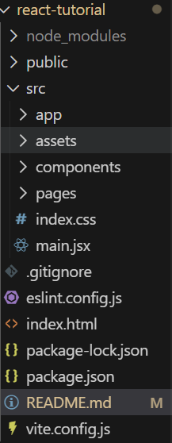

## create react project
npm create vite@latest

## file structure

## install MUI 
npm install @mui/material @emotion/react @emotion/styled
npm install @mui/material @mui/styled-engine-sc styled-components
npm install @mui/icons-material

## install React-Router-Dom for navigation
npm i react-router-dom

## Create components for using where we want like function
componenets create with pass paramiters ({})
if you want style component use claseName from component too and css like that ".button.button"